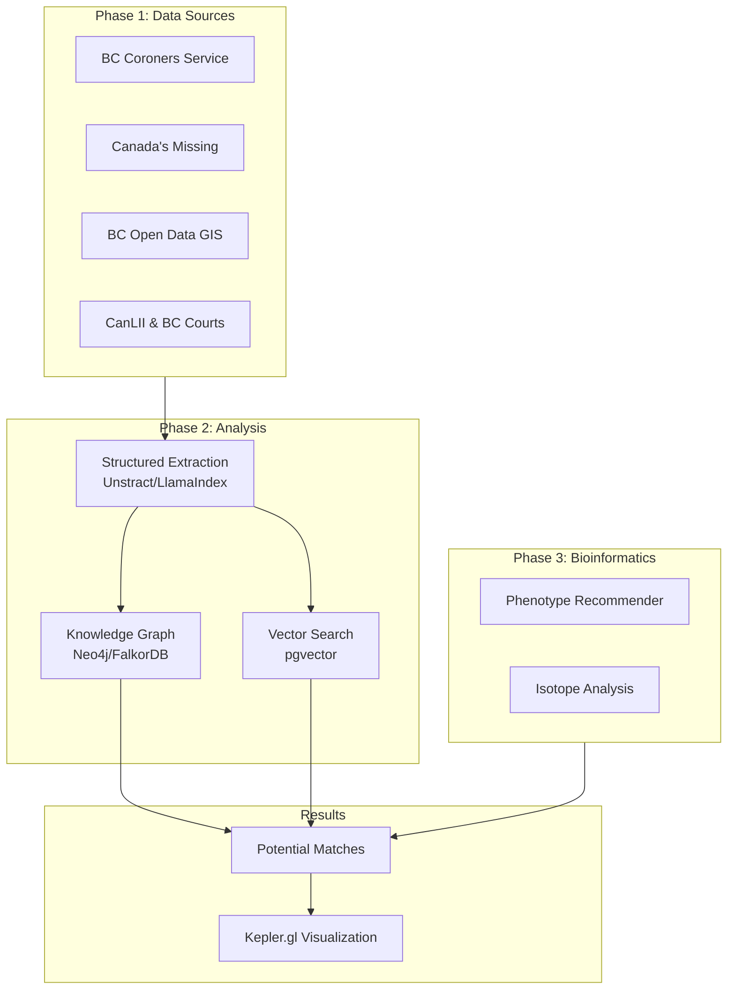

# BC Cold Case Hybrid RAG System - FILAMENT

[](https://opensource.org/licenses/MIT)
[](https://www.python.org/downloads/)

> **F**orensic **I**ntelligence **L**inking **A**nd **M**atching via **E**mbedded **N**etwork **T**echnology

A Hybrid Retrieval-Augmented Generation (RAG) system designed to connect "hard facts" (structured data) with "loose threads" (unstructured narrative) for cold case investigation in British Columbia.

## 🎯 Mission

Bridge the gap between verified forensic data and unstructured investigative narratives to identify potential matches between **unidentified human remains** and **missing persons** cases in BC.

## 🏗️ Architecture Overview



## 📁 Project Structure

```
filament/
├── docs/                    # Detailed documentation
│   ├── architecture.md      # System architecture
│   ├── data_sources.md      # Phase 1: Data sources
│   ├── analysis_approaches.md # Phase 2: Analysis
│   ├── bioinformatics.md    # Phase 3: Bio-analysis
│   └── tech_stack.md        # Technology stack
├── code/                    # Source code
│   ├── extraction/          # Structured data extraction
│   ├── graph/               # Knowledge graph operations
│   ├── search/              # Vector search & matching
│   └── scrapers/            # Data source scrapers
├── data/                    # Data directory (gitignored)
│   ├── raw/                 # Raw data files
│   ├── processed/           # Processed datasets
│   └── external/            # External reference data
├── config/                  # Configuration files
├── notebooks/               # Jupyter notebooks
└── tests/                   # Test suite
```

## 🚀 Quick Start

### Prerequisites

- Python 3.10+
- PostgreSQL with pgvector extension
- Ollama (for local LLM inference)

### Installation

```bash
# Clone the repository
git clone https://github.com/yourusername/filament.git
cd filament

# Create virtual environment
python -m venv venv
source venv/bin/activate  # Linux/macOS

# Install dependencies
pip install -r requirements.txt

# Copy environment template
cp .env.example .env
# Edit .env with your configuration
```

### Running the System

```bash
# Start PostgreSQL with pgvector
# (See docs/tech_stack.md for setup instructions)

# Initialize the database
python -m code.db.init

# Start the extraction pipeline
python -m code.extraction.pipeline
```

## 📚 Documentation

| Document | Description |
|----------|-------------|
| [Architecture](docs/architecture.md) | System design and data flow |
| [Data Sources](docs/data_sources.md) | BC-specific data sources and integration |
| [Analysis Approaches](docs/analysis_approaches.md) | Extraction, graph, and vector search |
| [Bioinformatics](docs/bioinformatics.md) | Phenotype and isotope analysis |
| [Tech Stack](docs/tech_stack.md) | Technology choices and setup |

## 🔒 Privacy & Ethics

This system is designed with privacy as a core principle:

- **No raw DNA data**: Only phenotypic descriptions and metadata are processed
- **Local LLM inference**: Sensitive data never leaves the system
- **Public sources only**: All data comes from publicly accessible sources
- **Audit trail**: All matches and inferences are logged for review

## 🤝 Contributing

See [docs/contributing.md](docs/contributing.md) for guidelines on how to contribute to this project.

## 📄 License

This project is licensed under the MIT License - see the [LICENSE](LICENSE) file for details.

---

**Disclaimer**: This is a research tool intended to assist investigators. All potential matches must be verified through proper forensic and legal channels before any action is taken.
