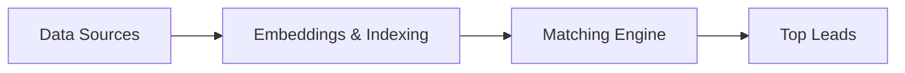

# FILAMENT: Cold Case Hybrid RAG System

[](https://opensource.org/licenses/MIT)
[](https://www.python.org/downloads/)

> **F**orensic **I**ntelligence **L**inking **A**nd **M**atching via **E**mbedded **N**etwork **T**echnology

A Hybrid Retrieval-Augmented Generation (RAG) system designed to connect "hard facts" (structured data) with "loose threads" (unstructured narrative) for cold case investigation.

## 🎯 Mission

Bridge the gap between verified forensic data and unstructured investigative narratives to identify potential matches between **unidentified human remains** and **missing persons** cases across North America and beyond.

## 🏗️ Architecture Overview



## 📁 Project Structure

```
filament/
├── code/                # Source code and scripts
│   ├── core/            # Core logic (extraction, graph, search, scrapers)
│   ├── devenv/          # Development environment configs
│   └── scripts/         # Operational scripts / CLI tools
├── data/
│   ├── external/        # Third-party reference data
│   ├── processed/       # Cleaned and canonicalized data
│   ├── raw/             # Immutable raw scrape data
│   └── reports/         # Generated investigative reports
├── docs/                # Project documentation
└── ...
```

## 🚀 Quick Start

### Prerequisites

- Python 3.10+
- PostgreSQL with pgvector extension (optional, SQLite used by default)
- Ollama (for local LLM inference)

### Installation

```bash
# Clone the repository
git clone https://github.com/yourusername/filament.git
cd filament

# Create virtual environment
python -m venv venv
source venv/bin/activate  # Linux/macOS

# Install dependencies
pip install -r code/requirements.txt

# Copy environment template
cp code/devenv/.env.example .env
# Edit .env with your configuration
```

### Running the System

```bash
# Initialize the database (builds filament.db)
python3 code/scripts/build_sqlite_db.py

# Run the investigative lead discovery
python3 -m code.core
```

## 📚 Documentation

| Document | Description |
|----------|-------------|
| [Architecture](docs/architecture.md) | System design and data flow |
| [Data Sources](docs/data_sources.md) | Sources (NamUs, NCMPUR, etc.) and integration |
| [Analysis Approaches](docs/analysis_approaches.md) | Extraction, graph, and vector search |
| [Bioinformatics](docs/bioinformatics.md) | Phenotype and isotope analysis |
| [Tech Stack](docs/tech_stack.md) | Technology choices and setup |
| [Contributing](docs/contributing.md) | How to help with Filament |

## 🔒 Privacy & Ethics

This system is designed with privacy as a core principle:

- **No raw DNA data**: Only phenotypic descriptions and metadata are processed
- **Local LLM inference**: Sensitive data never leaves the system
- **Public sources only**: All data comes from publicly accessible sources
- **Audit trail**: All matches and inferences are logged for review

## 🤝 Contributing

See [docs/contributing.md](docs/contributing.md) for guidelines on how to contribute to this project.

## 📄 License

This project is licensed under the MIT License - see the [LICENSE.md](LICENSE.md) file for details.

---

**Disclaimer**: This is a research tool intended to assist investigators. All potential matches must be verified through proper forensic and legal channels before any action is taken.
