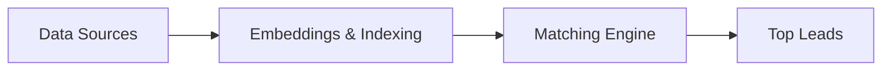

# FILAMENT: Cold Case Hybrid RAG System

[](https://opensource.org/licenses/MIT)
[](https://www.python.org/downloads/)

> **F**orensic **I**ntelligence **L**inking **A**nd **M**atching via **E**mbedded **N**etwork **T**echnology

A Hybrid Retrieval-Augmented Generation (RAG) system designed to connect "hard facts" (structured data) with "loose threads" (unstructured narrative) for cold case investigation.

## 🎯 Mission

Bridge the gap between verified forensic data and unstructured investigative narratives to identify potential matches between **unidentified human remains** and **missing persons** cases across North America and beyond.

## 🏗️ Architecture Overview


```mermaid
flowchart LR
    Data[Data Sources] --> Embed[Embeddings & Indexing]
    Embed --> Match[Matching Engine]
    Match --> Leads[Top Leads]
```

## 📁 Project Structure

```
filament/
├── code/                # Source code and scripts
│   ├── core/            # Core logic (extraction, graph, search, scrapers)
│   ├── devenv/          # Development environment (Containerfile, etc.)
│   └── scripts/         # Operational scripts / CLI tools (dev.sh)
├── data/
│   ├── external/        # Third-party reference data
│   ├── processed/       # Cleaned and canonicalized data
│   ├── raw/             # Immutable raw scrape data
│   └── reports/         # Generated investigative reports
├── docs/                # Project documentation
└── ...
```

## 🚀 Quick Start

### Prerequisites

- **Podman** or **Docker**
- **Ollama** (optional if running locally, embedded in container)

### Running in Container (Recommended)

Filament is optimized to run as a single containerized environment that includes the core engine and an embedded Ollama service for LLM inference.

```bash
# Clone the repository
git clone https://github.com/yourusername/filament.git
cd filament

# Start the environment (builds and runs the container)
./code/scripts/dev.sh up

# Initialize the database (inside the container)
./code/scripts/dev.sh run python code/scripts/build_sqlite_db.py

# Run the investigative lead discovery
./code/scripts/dev.sh run python -m core
```

### Running Locally (Native)

If you prefer to run natively, you will need Python 3.10+ and a local Ollama service.

```bash
# Create and activate virtual environment
python -m venv venv
source venv/bin/activate

# Install dependencies
pip install -r code/requirements.txt

# Initialize database
python3 code/scripts/build_sqlite_db.py

# Run the system
python3 -m code.core
```

### Fossil Knowledge Base (Optional, Recommended for RAG UI)

Filament can stream its curated narratives into a local Fossil repository so you can
query them with Fossil's AI tooling and web UI.

This repository is **Git-only for version control**. Fossil is used strictly as a
local knowledge database for AI notes, vectors, and retrieval workflows. The
knowledge DB and workspace (`data/knowledge.fossil`, `data/knowledge_workspace/`)
should remain local and uncommitted.

```bash
# Initialize Fossil knowledge base (one-time)
fossil init data/knowledge.fossil
fossil open data/knowledge.fossil data/knowledge_workspace

# Ingest all Filament data into Fossil (UHR, Missing Persons, Reddit, Leads)
python3 code/scripts/ingest_all_to_fossil.py

# Verify AI tables are ready
fossil ai status -R data/knowledge.fossil
```

Notes:
- This flow uses SQLite inserts into Fossil's AI tables for speed and reproducibility.
- If your Fossil build has a separate semantic indexing command, run it after ingestion.

## 📚 Documentation

| Document | Description |
|----------|-------------|
| [Architecture](docs/architecture.md) | System design and data flow |
| [Data Sources](docs/data_sources.md) | Sources (NamUs, NCMPUR, etc.) and integration |
| [Analysis Approaches](docs/analysis_approaches.md) | Extraction, graph, and vector search |
| [Bioinformatics](docs/bioinformatics.md) | Phenotype and isotope analysis |
| [Tech Stack](docs/tech_stack.md) | Technology choices and setup |
| [Contributing](docs/contributing.md) | How to help with Filament |
| [Fossil Knowledge Base](docs/fossil_knowledge_base.md) | Fossil AI setup and ingestion |
| [Roadmap](docs/roadmap.md) | Dual-track plan and missing features |
| [Knowledge Note Contract](docs/knowledge_note_contract.md) | Neutral exchange schema |

## 🔒 Privacy & Ethics

This system is designed with privacy as a core principle:

- **No raw DNA data**: Only phenotypic descriptions and metadata are processed
- **Local LLM inference**: Sensitive data never leaves the system
- **Public sources only**: All data comes from publicly accessible sources
- **Audit trail**: All matches and inferences are logged for review

## 🤝 Contributing

See [docs/contributing.md](docs/contributing.md) for guidelines on how to contribute to this project.

## 📄 License

This project is licensed under the MIT License - see the [LICENSE.md](LICENSE.md) file for details.

---

**Disclaimer**: This is a research tool intended to assist investigators. All potential matches must be verified through proper forensic and legal channels before any action is taken.
