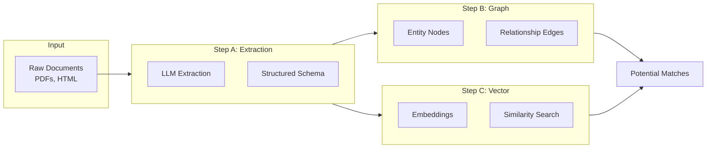
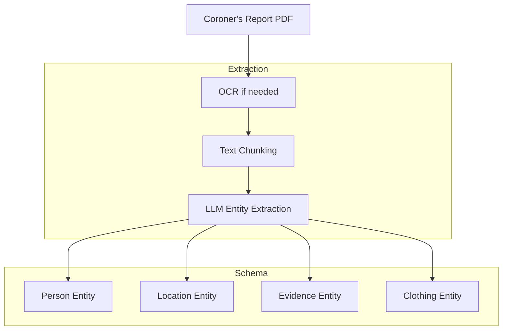
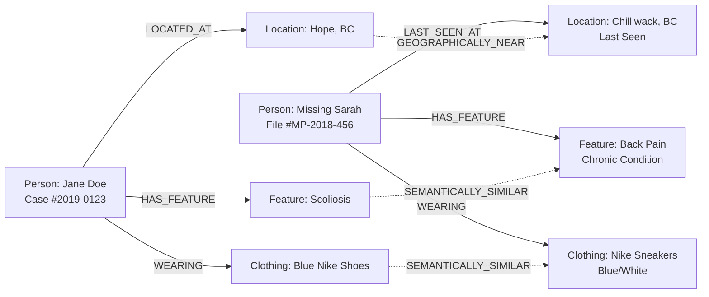
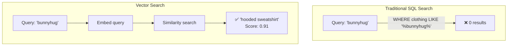
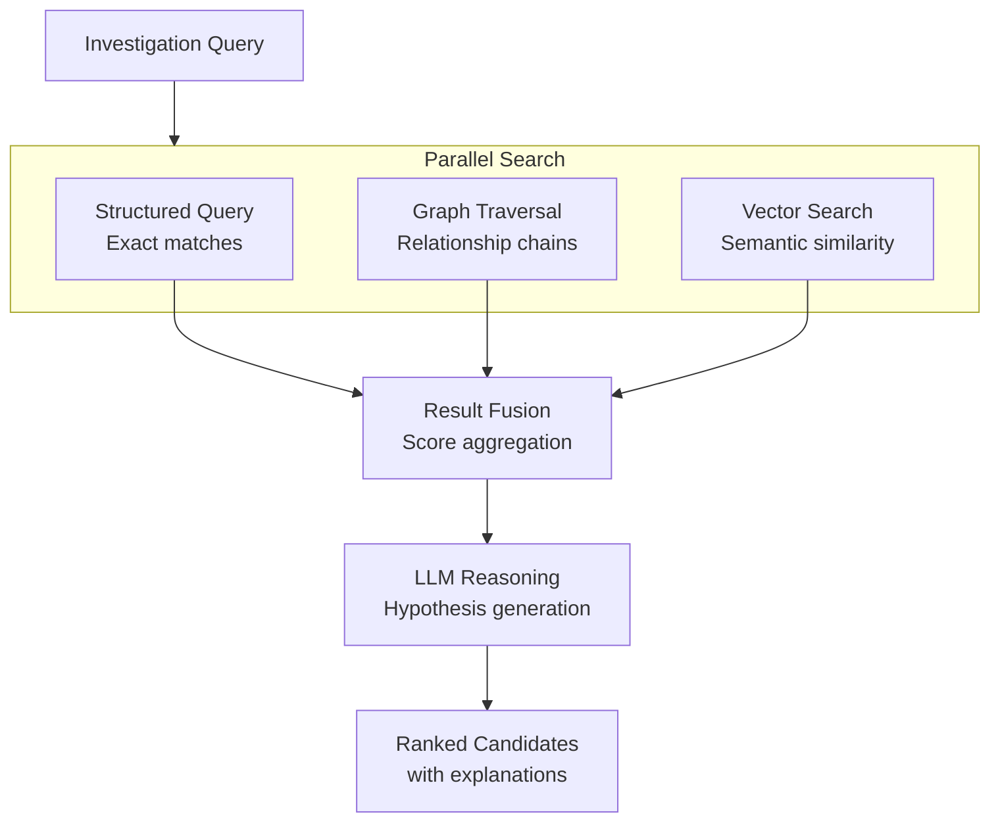

# Phase 2: Analysis Approaches

This document details the innovative analysis approaches that move beyond keyword matching to find "weak signals" between unconnected cases.

## Overview



---

## Step A: Structured Extraction (Hard Facts)

### Purpose
Transform unstructured narrative reports into queryable structured data.

### Tools
- **Unstract**: Open-source PDF/document extraction
- **LlamaIndex**: LLM-powered entity extraction

### The Extraction Pipeline



### Fact-Extraction Prompt

```
You are a forensic data analyst. Extract the following entities 
from this BC Coroner's report in JSON format:

REQUIRED FIELDS:
- case_id: The official case number
- date_found: Date remains were discovered (YYYY-MM-DD)
- pmi_estimate: Post-Mortem Interval if mentioned
- location: {name, coordinates, description}

PHYSICAL DESCRIPTION:
- estimated_age: Range in years
- estimated_sex: Male/Female/Unknown
- height_range: In cm
- weight_range: In kg

CLOTHING:
For each clothing item, extract:
- type: (shirt, pants, shoes, etc.)
- brand: If visible/mentioned
- color: Primary color
- condition: Description

DENTAL:
- dental_work: List of procedures if mentioned
- dental_chart_available: Yes/No

BIO_EVIDENCE:
- dna_available: Yes/No
- dna_type: (nuclear, mtDNA, etc.)
- isotope_analysis: If mentioned
- toxicology: If mentioned

Return valid JSON only.
```

### Output Schema

```json
{
  "case_id": "2019-0123-0001",
  "date_found": "2019-03-15",
  "location": {
    "name": "Hope, BC",
    "coordinates": [49.38, -121.44],
    "description": "Wooded area 2km from Highway 7"
  },
  "physical": {
    "estimated_age": [25, 35],
    "estimated_sex": "Female",
    "height_range": [160, 170],
    "weight_range": [55, 65]
  },
  "clothing": [
    {
      "type": "shoe",
      "brand": "Nike",
      "color": "blue",
      "condition": "worn, mud-stained"
    }
  ],
  "bio_evidence": {
    "dna_available": true,
    "dna_type": "mtDNA",
    "haplogroup": "H"
  }
}
```

---

## Step B: Knowledge Graph Construction

### Purpose
Link disparate data points through semantic relationships, enabling inference-based matching.

### Database
- **Neo4j** (primary recommendation)
- **FalkorDB** (lightweight alternative)

### Graph Schema



### Node Types

| Node Type | Properties | Example |
|-----------|------------|---------|
| `Person` | case_id, source, type (unidentified/missing), dates | Jane Doe case |
| `Location` | coordinates, name, region, precision | Hope, BC |
| `PhysicalFeature` | category, description, medical_term | Scoliosis |
| `Clothing` | type, brand, color, size, condition | Blue Nike shoes |
| `BioEvidence` | evidence_type, value, confidence | mtDNA haplogroup H |

### Edge Types

| Edge | Meaning | Example |
|------|---------|---------|
| `LOCATED_AT` | Discovery or last-seen location | Person → Location |
| `HAS_FEATURE` | Physical characteristic | Person → Feature |
| `WEARING` | Clothing association | Person → Clothing |
| `SEMANTICALLY_SIMILAR` | Inferred relationship | Feature ↔ Feature |
| `GEOGRAPHICALLY_NEAR` | Within threshold distance | Location ↔ Location |

### Inference Example

```cypher
// Find potential matches via medical condition similarity
MATCH (unid:Person {type: 'unidentified'})-[:HAS_FEATURE]->(uf:PhysicalFeature)
MATCH (miss:Person {type: 'missing'})-[:HAS_FEATURE]->(mf:PhysicalFeature)
WHERE uf.medical_term = mf.medical_term
   OR semanticSimilarity(uf.description, mf.description) > 0.8
RETURN unid, miss, uf, mf
ORDER BY semanticSimilarity(uf.description, mf.description) DESC
```

---

## Step C: Vector Search for Loose Threads

### Purpose
Catch non-exact matches that keyword searches miss using semantic embeddings.

### Tools
- **pgvector**: PostgreSQL extension for vector operations
- **sentence-transformers**: Generate embeddings

### The "Bunnyhug" Problem



**Scenario**:
- **Source A (Missing Person)**: "She was wearing a bunnyhug." (Saskatchewan/Western Canada slang)
- **Source B (Unidentified Remains)**: "Found with a hooded sweatshirt."

**Solution**: Vector embeddings understand semantic equivalence in Canadian context.

### Implementation

```python
from sentence_transformers import SentenceTransformer
import numpy as np

model = SentenceTransformer('all-MiniLM-L6-v2')

def embed_text(text: str) -> np.ndarray:
    """Generate embedding for text."""
    return model.encode(text)

def find_similar(
    query: str, 
    stored_embeddings: list[tuple[str, np.ndarray]],
    threshold: float = 0.75
) -> list[tuple[str, float]]:
    """Find semantically similar descriptions."""
    query_embed = embed_text(query)
    
    results = []
    for text, embedding in stored_embeddings:
        similarity = np.dot(query_embed, embedding) / (
            np.linalg.norm(query_embed) * np.linalg.norm(embedding)
        )
        if similarity >= threshold:
            results.append((text, float(similarity)))
    
    return sorted(results, key=lambda x: x[1], reverse=True)
```

### PostgreSQL with pgvector

```sql
-- Create table with vector column
CREATE TABLE descriptions (
    id SERIAL PRIMARY KEY,
    source_id TEXT,
    text TEXT,
    embedding vector(384)  -- dimension depends on model
);

-- Create index for fast similarity search
CREATE INDEX ON descriptions 
USING ivfflat (embedding vector_cosine_ops)
WITH (lists = 100);

-- Find similar descriptions
SELECT source_id, text, 
       1 - (embedding <=> query_embedding) AS similarity
FROM descriptions
WHERE 1 - (embedding <=> query_embedding) > 0.75
ORDER BY embedding <=> query_embedding
LIMIT 10;
```

### Embedding Strategy

| Content Type | Embedding Approach |
|--------------|-------------------|
| **Physical descriptions** | Full sentence embedding |
| **Clothing items** | Structured: "{color} {brand} {type}" |
| **Medical conditions** | Medical term + lay description |
| **Locations** | Name + region + geographic context |

---

## Combining All Three Steps



### Confidence Scoring

Each match candidate receives a composite score:

```python
def calculate_match_score(
    structured_match: float,  # SQL query match (0-1)
    graph_path_score: float,  # Graph connection strength (0-1)
    vector_similarity: float,  # Semantic similarity (0-1)
    weights: dict = None
) -> float:
    """Calculate weighted match confidence score."""
    weights = weights or {
        'structured': 0.4,
        'graph': 0.3,
        'vector': 0.3
    }
    
    return (
        weights['structured'] * structured_match +
        weights['graph'] * graph_path_score +
        weights['vector'] * vector_similarity
    )
```
