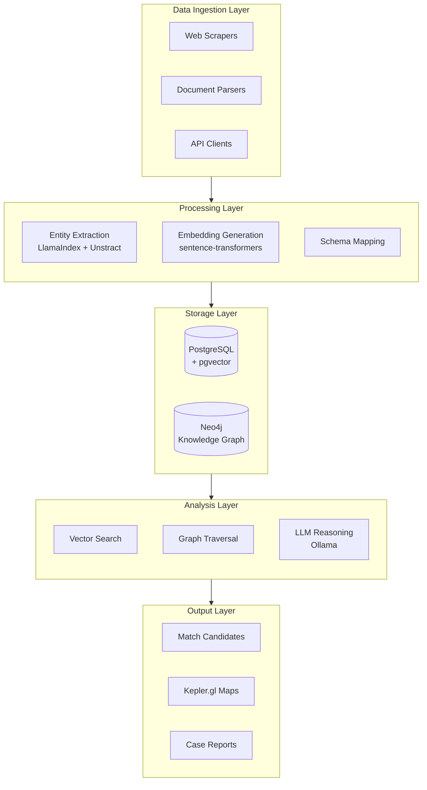
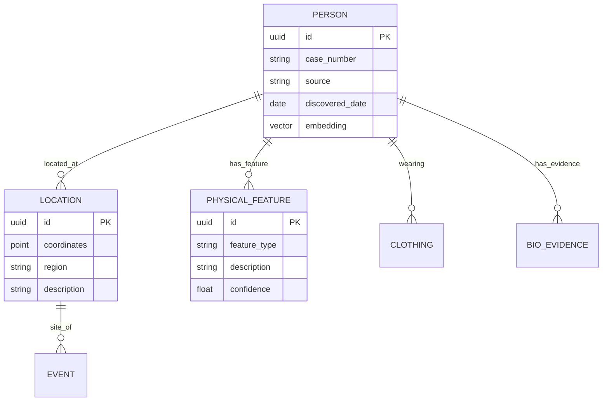
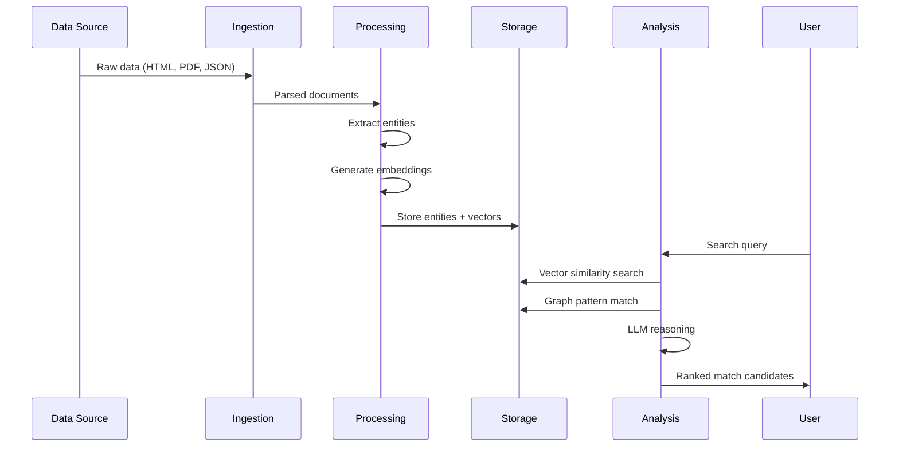
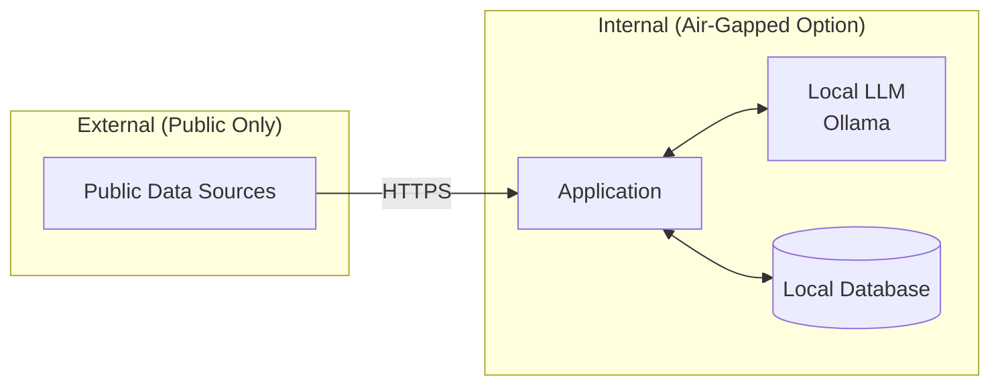

# System Architecture

FILAMENT uses a **Hybrid Retrieval-Augmented Generation (RAG)** architecture that treats text and biological metadata as connected nodes in a knowledge graph rather than isolated records.

## High-Level Architecture

## Core Components

### 1. Data Ingestion Layer

Responsible for acquiring data from heterogeneous sources:

| Component | Purpose | Sources |
|-----------|---------|---------|
| **Web Scrapers** | Extract data from public GIS viewers | BCCS Viewer, BC Open Data |
| **Document Parsers** | Process PDFs and legal documents | CanLII, Coroner reports |
| **API Clients** | Interface with structured APIs | NCMPUR, BC Data Catalogue |

### 2. Processing Layer

Transforms raw data into queryable entities:

- **Entity Extraction**: LLM-powered extraction of structured facts from narrative text
- **Embedding Generation**: Vector representations for semantic search
- **Schema Mapping**: Normalize entities to unified data model

### 3. Storage Layer

Dual-database architecture for complementary query patterns:

### 4. Analysis Layer

Multi-modal search and reasoning:

- **Vector Search**: Semantic similarity matching (e.g., "bunnyhug" ↔ "hooded sweatshirt")
- **Graph Traversal**: Find connections through shared attributes
- **LLM Reasoning**: Generate match hypotheses with explainable reasoning

## Data Flow

## Privacy-First Design

Key privacy measures:
- All LLM inference runs locally via Ollama
- No raw DNA data processed - only phenotypic metadata
- Audit logging for all match operations
- Optional air-gapped deployment

## Deployment Options

| Option | Use Case | Components |
|--------|----------|------------|
| **Local Development** | Research & prototyping | SQLite, Ollama, single machine |
| **Lab Deployment** | Investigation team | PostgreSQL, Neo4j, internal network |
| **Secure Production** | Operational use | Air-gapped, encrypted storage, audit logging |
