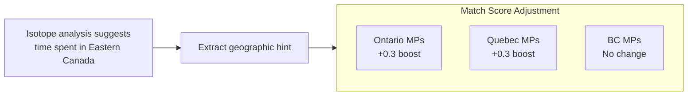

# Phase 3: Bioinformatics Proxy Analysis

This document describes how FILAMENT handles biological metadata **without** accessing protected genetic data, using publicly available phenotypic information to enhance matching accuracy.

> ⚠️ **Privacy First**: This system does NOT process raw DNA sequences (.fasta, .bam files). Only publicly available phenotypic descriptions and aggregated population genetics data are used.

## Overview

```mermaid
flowchart TB
    subgraph Input["Public Bio-Metadata"]
        Phenotype[Phenotype Descriptions<br/>"Blue eyes, fair skin"]
        Isotope[Isotope Analysis Results<br/>"Time spent in Eastern Canada"]
        Ancestry[Ancestry Estimates<br/>"European/Indigenous mix"]
    end
    
    subgraph Processing["Proxy Analysis"]
        Freq[Population Frequency<br/>Scoring]
        Geo[Geographic Origin<br/>Estimation]
        Demo[Demographic<br/>Filtering]
    end
    
    subgraph Output["Match Enhancement"]
        Boost[Match Score<br/>Boosting]
        Filter[Candidate<br/>Filtering]
    end
    
    Input --> Processing --> Output
```

---

## 1. Phenotype Recommender System

### Purpose
Use publicly available genomic frequency tables to assign probability scores to phenotype profiles.

### Data Source
- **1000 Genomes Project**: Population-level allele frequencies
- **gnomAD**: Aggregated allele frequency data
- **Published literature**: Phenotype-genotype correlations

### Phenotype Probability Scoring

Given a phenotypic description, calculate the probability of that profile originating from specific demographic groups in BC.

```python
from dataclasses import dataclass
from typing import Dict, List

@dataclass
class PhenotypeProfile:
    """Phenotype description from coroner report."""
    eye_color: str  # blue, brown, green, hazel
    hair_color: str  # blonde, brown, black, red
    skin_tone: str  # fair, medium, dark
    ancestry_estimate: str | None  # if mentioned

# Population frequency data (simplified example)
PHENOTYPE_FREQUENCIES = {
    "European": {
        "blue_eyes": 0.35,
        "fair_skin": 0.85,
        "blonde_hair": 0.20
    },
    "Indigenous_BC": {
        "brown_eyes": 0.95,
        "dark_hair": 0.98,
        "medium_skin": 0.80
    },
    "East_Asian": {
        "brown_eyes": 0.99,
        "dark_hair": 0.99,
        "medium_skin": 0.85
    }
}

def calculate_ancestry_probability(
    profile: PhenotypeProfile,
    population: str
) -> float:
    """
    Calculate probability that phenotype matches population.
    
    Uses Bayesian approach with population priors.
    """
    freq = PHENOTYPE_FREQUENCIES.get(population, {})
    
    # Simplified probability calculation
    prob = 1.0
    if profile.eye_color == "blue":
        prob *= freq.get("blue_eyes", 0.1)
    elif profile.eye_color == "brown":
        prob *= freq.get("brown_eyes", 0.5)
    
    # Continue for other traits...
    return prob
```

### BC Demographic Context

British Columbia's population includes:
- European-descended populations (various origins)
- Indigenous peoples (First Nations, Métis, Inuit)
- East Asian communities
- South Asian communities
- Mixed ancestry individuals

The system applies BC-specific demographic priors when no ancestry estimate is available.

---

## 2. Isotope Analysis Integration

### Purpose
Use stable isotope ratios (when mentioned in reports) to estimate geographic origin and movement patterns.

### Scientific Background

| Isotope Ratio | Indicates | Source |
|---------------|-----------|--------|
| **δ¹⁸O (Oxygen)** | Latitude/altitude of water consumed | Drinking water |
| **δ²H (Hydrogen)** | Climate zone | Food/water |
| **⁸⁷Sr/⁸⁶Sr (Strontium)** | Geological region | Local diet |

### Geographic Boosting



### Implementation

```python
from enum import Enum

class IsotopeRegion(Enum):
    """Geographic regions identifiable by isotope signatures."""
    COASTAL_BC = "coastal_bc"
    INTERIOR_BC = "interior_bc"
    PRAIRIES = "prairies"
    EASTERN_CANADA = "eastern_canada"
    NORTHERN = "northern"
    UNKNOWN = "unknown"

def parse_isotope_mention(text: str) -> IsotopeRegion | None:
    """
    Extract isotope-based geographic hints from text.
    
    Examples:
        "isotope analysis suggests Eastern Canada origin"
        -> IsotopeRegion.EASTERN_CANADA
    """
    patterns = {
        IsotopeRegion.EASTERN_CANADA: [
            r"eastern\s+canada",
            r"ontario",
            r"quebec"
        ],
        IsotopeRegion.PRAIRIES: [
            r"prairie",
            r"alberta|saskatchewan|manitoba"
        ],
        IsotopeRegion.COASTAL_BC: [
            r"coastal.*(?:bc|british columbia)",
            r"vancouver.*island"
        ]
    }
    
    for region, regex_list in patterns.items():
        for pattern in regex_list:
            if re.search(pattern, text.lower()):
                return region
    
    return None

def apply_isotope_boost(
    missing_person_province: str,
    isotope_region: IsotopeRegion,
    base_score: float
) -> float:
    """
    Boost match score based on isotope/province alignment.
    """
    boost_map = {
        IsotopeRegion.EASTERN_CANADA: {
            "Ontario": 0.3,
            "Quebec": 0.3,
            "British Columbia": -0.1  # Less likely
        },
        IsotopeRegion.PRAIRIES: {
            "Alberta": 0.3,
            "Saskatchewan": 0.3,
            "Manitoba": 0.25
        }
    }
    
    boost = boost_map.get(isotope_region, {}).get(
        missing_person_province, 0.0
    )
    
    return min(1.0, base_score + boost)
```

---

## 3. mtDNA Haplogroup Clustering

### Purpose
Use maternally-inherited mitochondrial DNA haplogroups for population-level matching hints.

### Haplogroup Geography

| Haplogroup | Primary Associated Regions |
|------------|---------------------------|
| **A, B, C, D** | Indigenous Americas, East Asia |
| **H, V, U, K** | European |
| **L** | African |
| **M, N** | South Asian, Southeast Asian |

### Matching Logic

```python
HAPLOGROUP_AFFINITY = {
    "A": ["Indigenous_Americas", "East_Asian"],
    "B": ["Indigenous_Americas", "East_Asian"],
    "C": ["Indigenous_Americas", "East_Asian", "Siberian"],
    "D": ["Indigenous_Americas", "East_Asian"],
    "H": ["European"],
    "V": ["European"],
    "U": ["European", "South_Asian"],
    "K": ["European"],
    "L": ["African"],
    "M": ["South_Asian", "Southeast_Asian"],
}

def haplogroup_compatible(
    unid_haplogroup: str | None,
    missing_ancestry: str | None
) -> float:
    """
    Check if haplogroup is compatible with stated ancestry.
    
    Returns compatibility score (0.0 to 1.0).
    """
    if not unid_haplogroup or not missing_ancestry:
        return 0.5  # Unknown, neutral score
    
    # Get first letter (major haplogroup)
    major = unid_haplogroup[0].upper()
    
    affinities = HAPLOGROUP_AFFINITY.get(major, [])
    
    for affinity in affinities:
        if affinity.lower() in missing_ancestry.lower():
            return 0.9  # Strong compatibility
    
    return 0.2  # Unlikely but not impossible
```

---

## 4. Composite Bio-Score

All biological proxy signals are combined into a single bio-compatibility score:

```python
@dataclass
class BioScore:
    """Biological compatibility scores for a match candidate."""
    phenotype_probability: float  # 0-1
    isotope_alignment: float  # 0-1
    haplogroup_compatibility: float  # 0-1
    
    def composite(self, weights: dict = None) -> float:
        """Calculate weighted composite score."""
        weights = weights or {
            "phenotype": 0.4,
            "isotope": 0.35,
            "haplogroup": 0.25
        }
        
        return (
            weights["phenotype"] * self.phenotype_probability +
            weights["isotope"] * self.isotope_alignment +
            weights["haplogroup"] * self.haplogroup_compatibility
        )
```

---

## Ethical Considerations

### What We Do
✅ Use published population frequency data  
✅ Parse phenotypic descriptions from public reports  
✅ Apply statistical probability based on aggregate data  
✅ Treat all results as investigative leads, not conclusions  

### What We Don't Do
❌ Access or process raw DNA sequence files  
❌ Store individual genetic profiles  
❌ Make definitive identity conclusions from bio-data alone  
❌ Use protected health information  

### Required Disclaimers

All bio-score outputs include:
1. **Confidence interval** on probability estimates
2. **Data source citation** for frequency tables used
3. **Explicit statement** that biological matching requires formal forensic confirmation
