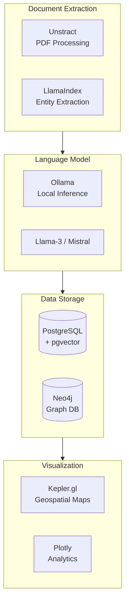

# Technology Stack

This document details the recommended technology choices for the FILAMENT BC Cold Case system.

## Stack Overview



---

## 1. Document Extraction: Unstract

**Purpose**: Process unstructured PDFs and documents into machine-readable text.

**Website**: [unstract.com](https://unstract.com) (Open Source)

### Why Unstract?
- Handles complex PDF layouts (tables, multi-column)
- OCR for scanned documents
- Structured output for LLM consumption
- Open source with self-hosting option

### Installation

```bash
pip install unstract
```

### Usage Example

```python
from unstract.document import Document
from unstract.extractors import TextExtractor

# Load coroner's report PDF
doc = Document("path/to/coroner_report.pdf")

# Extract text with layout preservation
extractor = TextExtractor(
    preserve_layout=True,
    ocr_enabled=True
)
text = extractor.extract(doc)

# Output structured text for LLM processing
print(text)
```

---

## 2. LLM Orchestration: LlamaIndex

**Purpose**: Connect LLMs to data sources for intelligent extraction and querying.

**Website**: [llamaindex.ai](https://www.llamaindex.ai)

### Key Features
- Document loaders for multiple formats
- Structured output parsing
- Vector store integration
- Query engines

### Installation

```bash
pip install llama-index llama-index-llms-ollama llama-index-embeddings-huggingface
```

### Usage Example

```python
from llama_index.core import VectorStoreIndex, SimpleDirectoryReader
from llama_index.llms.ollama import Ollama
from llama_index.embeddings.huggingface import HuggingFaceEmbedding

# Configure local LLM
llm = Ollama(model="llama3", base_url="http://localhost:11434")

# Configure embeddings
embed_model = HuggingFaceEmbedding(
    model_name="sentence-transformers/all-MiniLM-L6-v2"
)

# Load documents
documents = SimpleDirectoryReader("data/reports/").load_data()

# Create searchable index
index = VectorStoreIndex.from_documents(
    documents,
    llm=llm,
    embed_model=embed_model
)

# Query
query_engine = index.as_query_engine()
response = query_engine.query("What clothing items were found?")
```

---

## 3. Local LLM: Ollama

**Purpose**: Run large language models locally for privacy-preserving inference.

**Website**: [ollama.ai](https://ollama.ai)

### Why Local LLM?
- **Privacy**: Sensitive case data never leaves the system
- **No API costs**: Unlimited inference
- **Customization**: Fine-tune for domain-specific extraction

### Supported Models

| Model | Parameters | Use Case |
|-------|------------|----------|
| **Llama 3** | 8B / 70B | Best overall performance |
| **Mistral** | 7B | Fast, good for extraction |
| **Mixtral** | 8x7B | Complex reasoning tasks |

### Installation

```bash
# Install Ollama
curl -fsSL https://ollama.ai/install.sh | sh

# Pull models
ollama pull llama3
ollama pull mistral

# Start server
ollama serve
```

### API Usage

```python
import requests

def query_ollama(prompt: str, model: str = "llama3") -> str:
    """Query local Ollama instance."""
    response = requests.post(
        "http://localhost:11434/api/generate",
        json={
            "model": model,
            "prompt": prompt,
            "stream": False
        }
    )
    return response.json()["response"]
```

---

## 4. Primary Database: PostgreSQL + pgvector

**Purpose**: Store structured data and vector embeddings in a single database.

### Why PostgreSQL + pgvector?
- Mature, reliable RDBMS
- Vector similarity search without separate vector DB
- Full SQL capabilities for structured queries
- ACID compliance for data integrity

### Installation

```bash
# Ubuntu/Debian
sudo apt install postgresql postgresql-contrib

# Install pgvector extension
git clone https://github.com/pgvector/pgvector.git
cd pgvector
make && sudo make install

# Enable in database
psql -d filament -c "CREATE EXTENSION vector;"
```

### Schema Design

```sql
-- Enable extensions
CREATE EXTENSION IF NOT EXISTS vector;
CREATE EXTENSION IF NOT EXISTS postgis;  -- For geospatial

-- Cases table (unidentified remains)
CREATE TABLE unidentified_cases (
    id UUID PRIMARY KEY DEFAULT gen_random_uuid(),
    case_number VARCHAR(50) UNIQUE NOT NULL,
    source VARCHAR(50) NOT NULL,
    discovery_date DATE,
    location GEOGRAPHY(POINT, 4326),
    description TEXT,
    embedding VECTOR(384),  -- For semantic search
    metadata JSONB,
    created_at TIMESTAMP DEFAULT NOW(),
    updated_at TIMESTAMP DEFAULT NOW()
);

-- Missing persons table
CREATE TABLE missing_persons (
    id UUID PRIMARY KEY DEFAULT gen_random_uuid(),
    file_number VARCHAR(50) UNIQUE NOT NULL,
    source VARCHAR(50) NOT NULL,
    last_seen_date DATE,
    last_seen_location GEOGRAPHY(POINT, 4326),
    physical_description TEXT,
    embedding VECTOR(384),
    metadata JSONB,
    created_at TIMESTAMP DEFAULT NOW(),
    updated_at TIMESTAMP DEFAULT NOW()
);

-- Vector similarity index
CREATE INDEX ON unidentified_cases 
USING ivfflat (embedding vector_cosine_ops) WITH (lists = 100);

CREATE INDEX ON missing_persons 
USING ivfflat (embedding vector_cosine_ops) WITH (lists = 100);

-- Geospatial index
CREATE INDEX ON unidentified_cases USING GIST (location);
CREATE INDEX ON missing_persons USING GIST (last_seen_location);
```

---

## 5. Graph Database: Neo4j

**Purpose**: Model complex relationships between entities for inference-based matching.

### Why Neo4j?
- Industry-standard graph database
- Cypher query language
- Graph algorithms library
- Visualization tools

### Alternative: FalkorDB
For lighter deployments, [FalkorDB](https://www.falkordb.com/) offers Redis-compatible graph operations.

### Installation

```bash
# Docker deployment
docker run -d \
    --name neo4j \
    -p 7474:7474 -p 7687:7687 \
    -e NEO4J_AUTH=neo4j/password \
    -v neo4j_data:/data \
    neo4j:5.15
```

### Python Integration

```python
from neo4j import GraphDatabase

class GraphDB:
    def __init__(self, uri: str, user: str, password: str):
        self.driver = GraphDatabase.driver(uri, auth=(user, password))
    
    def create_person(self, case_id: str, properties: dict):
        with self.driver.session() as session:
            session.run(
                """
                CREATE (p:Person {case_id: $case_id})
                SET p += $props
                """,
                case_id=case_id,
                props=properties
            )
    
    def find_matches(self, case_id: str, threshold: float = 0.7):
        with self.driver.session() as session:
            result = session.run(
                """
                MATCH (u:Person {case_id: $case_id, type: 'unidentified'})
                MATCH (m:Person {type: 'missing'})
                WHERE u <> m
                WITH u, m, 
                     gds.similarity.cosine(u.embedding, m.embedding) AS sim
                WHERE sim > $threshold
                RETURN m.case_id, sim
                ORDER BY sim DESC
                """,
                case_id=case_id,
                threshold=threshold
            )
            return list(result)
```

---

## 6. Geospatial Visualization: Kepler.gl

**Purpose**: High-performance mapping of remains locations vs. missing persons last-seen points.

**Website**: [kepler.gl](https://kepler.gl)

### Why Kepler.gl?
- WebGL-powered for large datasets
- Time-series animation
- Multiple layer types
- Shareable map exports

### Integration

```python
from keplergl import KeplerGl

# Create map
map_viz = KeplerGl(height=600)

# Add unidentified remains layer
map_viz.add_data(
    data=unidentified_df,
    name="Unidentified Remains"
)

# Add missing persons last-seen layer
map_viz.add_data(
    data=missing_df,
    name="Missing Persons (Last Seen)"
)

# Configure visualization
config = {
    "version": "v1",
    "config": {
        "mapStyle": {
            "styleType": "dark"
        }
    }
}
map_viz.config = config

# Save to HTML
map_viz.save_to_html(file_name="bc_cold_cases_map.html")
```

---

## Development Environment

### Required Software

| Tool | Purpose | Installation |
|------|---------|--------------|
| Python 3.10+ | Primary language | System package manager |
| PostgreSQL 15+ | Primary database | `apt install postgresql` |
| Ollama | Local LLM | `curl -fsSL https://ollama.ai/install.sh \| sh` |
| Docker | Neo4j, services | Docker Desktop or `apt install docker.io` |

### Python Environment

```bash
# Create virtual environment
python -m venv venv
source venv/bin/activate

# Install dependencies
pip install -r requirements.txt

# Verify installation
python -c "import llama_index; print('LlamaIndex OK')"
python -c "import psycopg2; print('PostgreSQL OK')"
python -c "from neo4j import GraphDatabase; print('Neo4j OK')"
```

### Environment Variables

Copy `.env.example` to `.env` and configure:

```bash
cp .env.example .env
# Edit .env with your database credentials and settings
```

---

## Performance Considerations

| Component | Scaling Strategy |
|-----------|------------------|
| **PostgreSQL** | Connection pooling, read replicas |
| **pgvector** | IVFFlat index with appropriate list count |
| **Neo4j** | Memory configuration, index optimization |
| **Ollama** | GPU acceleration, model quantization |
| **Kepler.gl** | Data aggregation for large point sets |
