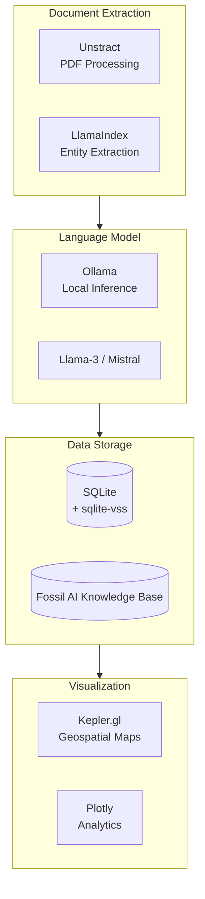

# Technology Stack

This document details the recommended technology choices for the FILAMENT BC Cold Case system.

## Stack Overview


```mermaid
flowchart TB
    subgraph Extraction["Document Extraction"]
        Unstract[Unstract<br/>PDF Processing]
        LlamaIndex[LlamaIndex<br/>Entity Extraction]
    end
    
    subgraph LLM["Language Model"]
        Ollama[Ollama<br/>Local Inference]
        Models[Llama-3 / Mistral]
    end
    
    subgraph Database["Data Storage"]
        SQLite[(SQLite<br/>+ sqlite-vss)]
        Fossil[(Fossil AI Knowledge Base)]
    end
    
    subgraph Viz["Visualization"]
        Kepler[Kepler.gl<br/>Geospatial Maps]
        Plotly[Plotly<br/>Analytics]
    end
    
    Extraction --> LLM
    LLM --> Database
    Database --> Viz
```

---

## 1. Document Extraction: Unstract

**Purpose**: Process unstructured PDFs and documents into machine-readable text.

**Website**: [unstract.com](https://unstract.com) (Open Source)

### Why Unstract?
- Handles complex PDF layouts (tables, multi-column)
- OCR for scanned documents
- Structured output for LLM consumption
- Open source with self-hosting option

### Installation

```bash
pip install unstract
```

### Usage Example

```python
from unstract.document import Document
from unstract.extractors import TextExtractor

# Load coroner's report PDF
doc = Document("path/to/coroner_report.pdf")

# Extract text with layout preservation
extractor = TextExtractor(
    preserve_layout=True,
    ocr_enabled=True
)
text = extractor.extract(doc)

# Output structured text for LLM processing
print(text)
```

---

## 2. LLM Orchestration: LlamaIndex

**Purpose**: Connect LLMs to data sources for intelligent extraction and querying.

**Website**: [llamaindex.ai](https://www.llamaindex.ai)

### Key Features
- Document loaders for multiple formats
- Structured output parsing
- Vector store integration
- Query engines

### Installation

```bash
pip install llama-index llama-index-llms-ollama llama-index-embeddings-huggingface
```

### Usage Example

```python
from llama_index.core import VectorStoreIndex, SimpleDirectoryReader
from llama_index.llms.ollama import Ollama
from llama_index.embeddings.huggingface import HuggingFaceEmbedding

# Configure local LLM
llm = Ollama(model="llama3", base_url="http://localhost:11434")

# Configure embeddings
embed_model = HuggingFaceEmbedding(
    model_name="sentence-transformers/all-MiniLM-L6-v2"
)

# Load documents
documents = SimpleDirectoryReader("data/reports/").load_data()

# Create searchable index
index = VectorStoreIndex.from_documents(
    documents,
    llm=llm,
    embed_model=embed_model
)

# Query
query_engine = index.as_query_engine()
response = query_engine.query("What clothing items were found?")
```

---

## 3. Local LLM: Ollama

**Purpose**: Run large language models locally for privacy-preserving inference.

**Website**: [ollama.ai](https://ollama.ai)

### Why Local LLM?
- **Privacy**: Sensitive case data never leaves the system
- **No API costs**: Unlimited inference
- **Customization**: Fine-tune for domain-specific extraction

### Supported Models

| Model | Parameters | Use Case |
|-------|------------|----------|
| **Llama 3** | 8B / 70B | Best overall performance |
| **Mistral** | 7B | Fast, good for extraction |
| **Mixtral** | 8x7B | Complex reasoning tasks |

### Installation

```bash
# Install Ollama
curl -fsSL https://ollama.ai/install.sh | sh

# Pull models
ollama pull llama3
ollama pull mistral

# Start server
ollama serve
```

### API Usage

```python
import requests

def query_ollama(prompt: str, model: str = "llama3") -> str:
    """Query local Ollama instance."""
    response = requests.post(
        "http://localhost:11434/api/generate",
        json={
            "model": model,
            "prompt": prompt,
            "stream": False
        }
    )
    return response.json()["response"]
```

---

## 4. Primary Database: SQLite + sqlite-vss

**Purpose**: Store structured case data and lightweight vector embeddings locally.

### Why SQLite + sqlite-vss?
- Zero-service footprint (easy local deployment)
- Works well for prototype and small-team workflows
- Compatible with Filament's current data loading scripts

### Installation

```bash
# SQLite is typically preinstalled
sqlite3 --version

# sqlite-vss setup varies by platform. See project docs for installation.
```

### Schema Notes
- `data/filament.db` stores `unidentified_cases` and `missing_persons`.
- Embeddings are stored alongside structured records.

---

## 5. Knowledge Base: Fossil AI

**Purpose**: Maintain a narrative knowledge base for RAG-style retrieval and UI access.

### Why Fossil AI?
- Durable, local, dependency-light store for narrative notes
- AI tables integrated directly into the repo database
- Clean handoff from ETL → indexing → UI chat

### Setup

```bash
fossil init data/knowledge.fossil
fossil open data/knowledge.fossil data/knowledge_workspace
fossil ai init -R data/knowledge.fossil
fossil ai status -R data/knowledge.fossil
```

### Ingestion

```bash
python3 code/scripts/ingest_all_to_fossil.py
```

---

## 6. Geospatial Visualization: Kepler.gl

**Purpose**: High-performance mapping of remains locations vs. missing persons last-seen points.

**Website**: [kepler.gl](https://kepler.gl)

### Why Kepler.gl?
- WebGL-powered for large datasets
- Time-series animation
- Multiple layer types
- Shareable map exports

### Integration

```python
from keplergl import KeplerGl

# Create map
map_viz = KeplerGl(height=600)

# Add unidentified remains layer
map_viz.add_data(
    data=unidentified_df,
    name="Unidentified Remains"
)

# Add missing persons last-seen layer
map_viz.add_data(
    data=missing_df,
    name="Missing Persons (Last Seen)"
)

# Configure visualization
config = {
    "version": "v1",
    "config": {
        "mapStyle": {
            "styleType": "dark"
        }
    }
}
map_viz.config = config

# Save to HTML
map_viz.save_to_html(file_name="bc_cold_cases_map.html")
```

---

## Development Environment

### Required Software

| Tool | Purpose | Installation |
|------|---------|--------------|
| Python 3.10+ | Primary language | System package manager |
| SQLite | Primary database | System package manager |
| Fossil | Knowledge base + AI tables | `apt install fossil` or https://fossil-scm.org |
| Ollama | Local LLM | `curl -fsSL https://ollama.ai/install.sh \| sh` |
| Docker | Optional dev services | Docker Desktop or `apt install docker.io` |

### Python Environment

```bash
# Create virtual environment
python -m venv venv
source venv/bin/activate

# Install dependencies
pip install -r requirements.txt

# Verify installation
python -c "import llama_index; print('LlamaIndex OK')"
python -c "import sqlite3; print('SQLite OK')"
fossil version
```

### Environment Variables

Copy `.env.example` to `.env` and configure:

```bash
cp .env.example .env
# Edit .env with your database credentials and settings
```

---

## Performance Considerations

| Component | Scaling Strategy |
|-----------|------------------|
| **SQLite** | Proper indexing and batching |
| **Fossil AI** | Keep notes concise and structured |
| **Ollama** | GPU acceleration, model quantization |
| **Kepler.gl** | Data aggregation for large point sets |
